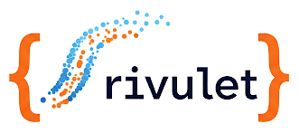

# Rivulet: Python Notebook Utilities for Curating Pedagogically Useful Datasets

A collection of Jupyter notebooks to help educators and educational designers find and download pedagogically useful subsets of data from large, public data streams. 
The notebooks emphasize finding datasets with complex patterns that can be explored using agent-based models.

Our goal is to help educators find data that is **personally, statistically, *and* topically** interesting.

## About Rivulet

These utilities are designed for educators who want to use fresh, relevant data in classrooms but may find searching large public data streams overwhelming. 
Rivulet helps you access and assess subsets of data that are local, timely, or otherwise relevant to your students. 
Importantly, it does this in a way that guides users toward data that exhibit key statistical and domain-specific characteristics that are known to be pedagogically generative. 
Along the way, the notebooks gently introduce general techniques and skills related to fetching data using APIs and Python. 

The name *Rivulet*—a small stream—refers to the goal of curating manageable, dynamic samples from larger data streams. 
It's also a nod to Tim Erickson's idea of being [Awash in Data](https://codap.xyz/awash/), and an acknowledgement that while there are some powerful [Oceans of Data](https://oceansofdata.org/) out there, finding one that's manageable, interesting, and ready to use can be difficult or even overwhelming.

## Target Audience

These tools are designed for advanced beginners to intermediate Python users. 
If you're an educator or designer who is comfortable with Python and wants to find compelling datasets without starting from scratch, Rivulet is for you.

## Acknowledgements

Rivulet is partially supported by a grant by the National Science Foundation (Award #2445609). 
Notebook contributions by Michelle Wilkerson, Adelmo Eloy, and Lucas Coletti.

## Questions and Contributions

Have questions or ideas? Please open an issue or feel free to reach out to Michelle Wilkerson (@michellehoda) here on GitHub.
